  

  

---

## 👩‍💻 Who Am I

I'm **Bhakti**:

📊 **Data Analyst.** I turn messy data into decisions people trust, with SQL, Power BI dashboards, and the validation checks that keep the numbers honest.

🧭 **Product.** I figure out which problem is actually worth solving, turn ambiguous stakeholder asks into clear specs, and define what success looks like.

⚙️ **Data Science Engineer.** I take ML out of the notebook and into production, from a live SEC-data risk model to full-stack AI apps.

The thread through all of it: **knowing what AI can be trusted to do alone, and where a deterministic check is needed.** ✨

🎓 MS Data Science @ Northeastern 

 

---

## 💼 Work Experience

> 🟣 **Business Intelligence Intern** · *EN-NOBLE, Portland, ME* · `Jan 2026 – Apr 2026`
> ▸ Independently designed and shipped a user-facing **cultural-discovery web app** using AI-assisted development, **increasing discovery-to-booking conversion by 25%**
> ▸ Built reusable SQL & Python validation checks for missing values, duplicates and inconsistent formats, **cutting manual reporting effort by 15%**
> ▸ Translated 8+ stakeholder discussions into **20+ workflow specs** and self-service guides for non-technical teammates

> 🔵 **Head Teaching Assistant, ML & Data Mining** · *Khoury College of Computer Sciences* · `Jan 2025 – Aug 2025`
> ▸ Supported **100+ students** building and evaluating ML models in Python and PyTorch on real-world datasets
> ▸ Coordinated and trained a **team of 5 TAs**, owned lab scheduling, and worked directly with the professor on course decisions
> ▸ Delivered **4 intro sessions to 50+ students** on foundational AI and data concepts

> 🟢 **Junior Data Analyst** · *Hupp Technologies, Ahmedabad, India* · `Mar 2023 – Apr 2024`
> ▸ Built Python financial data-processing workflows with **GitLab CI/CD** checks to catch errors before stakeholder reporting
> ▸ Developed **20+ DAX measures across 5 Power BI dashboards** for 12 cross-functional stakeholders
> ▸ Fixed the dashboards behind 15+ ad hoc requests, **cutting repeat requests by 60%**

---

## 🚀 Featured Projects

  
   
  
  

  
   
  
  

  
   
  

  
   
  

  
   
  

---

## 🛠️ Tech Stack

| 🎯 Area | 🧰 Tools |
|:--|:--|
| 💬 **Languages** |   |
| 🧠 **ML & Data** |        |
| 📐 **Analytics** |    |
| 🤖 **AI Tools** |    |
| 🗄️ **Databases** |   |
| 📊 **BI & Viz** |     |
| 🌐 **Web & Deployment** |  |
| 🧪 **Collaboration & Tools** |     |
| 🧭 **Product & Strategy** |        |

---

## 🎓 Education

> 🏫 **MS in Data Science** · *Northeastern University, Boston, MA* · `Sep 2024 – Dec 2026` · GPA **3.5 / 4.0**
> 📚 Supervised ML · Unsupervised ML · NLP · Intro to Data Management · Algorithms

> 🏫 **Bachelor of Information Technology** · *Gujarat Technological University, India* · `Jan 2020 – Jun 2024` · GPA **9.28 / 10**
> 📚 Data Structures · DBMS · Artificial Intelligence · Applied ML · Computer Vision

---

## 💌 Let's Connect

  
  
  

